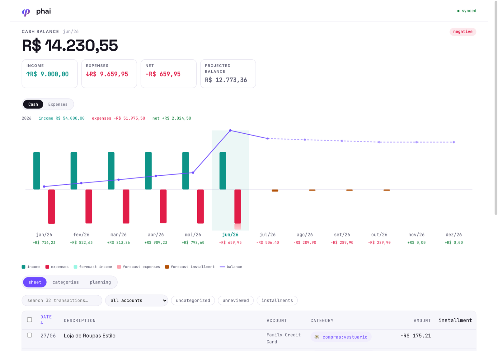
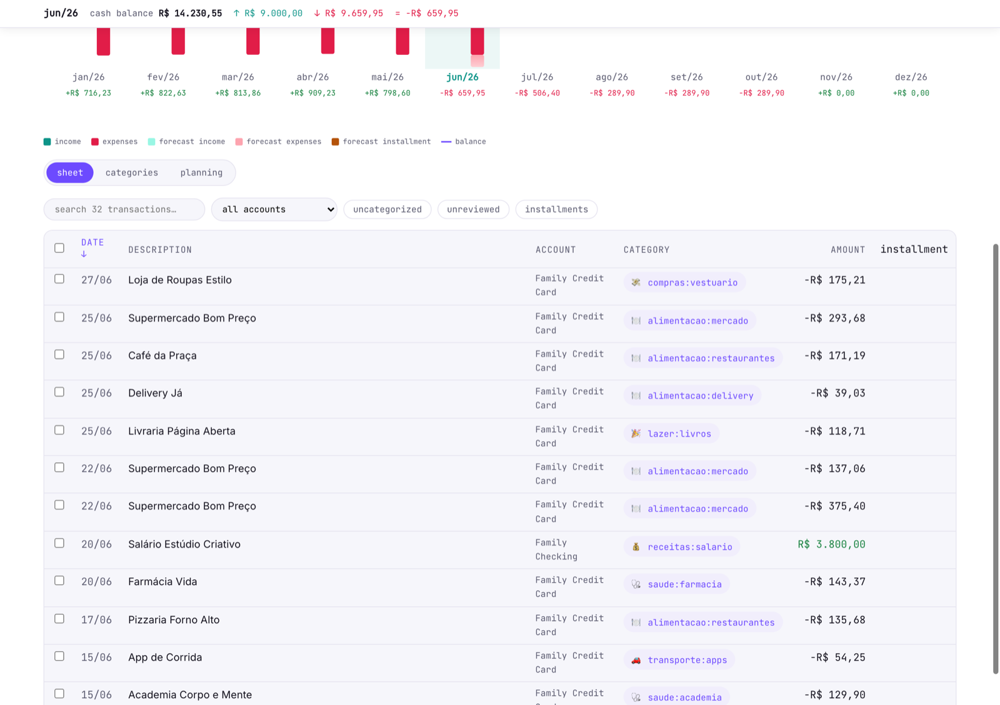
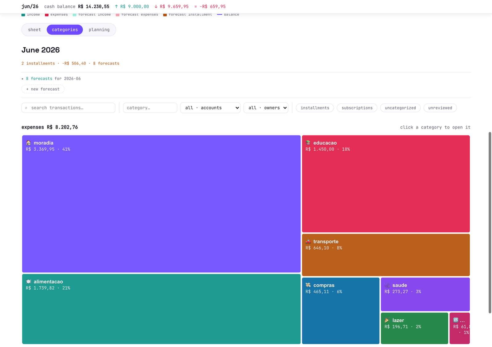
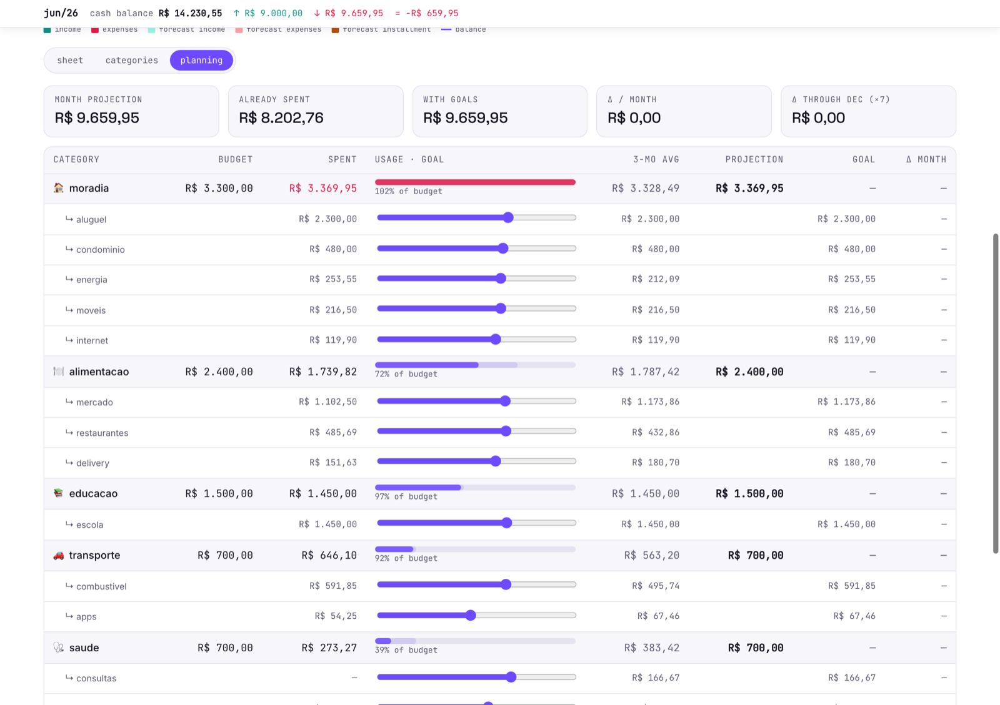

<div align="center">

# φ phai

**finanças da casa, inteligência de verdade.**

Rules-first, LLM-neutral personal-finance agent. Terminal-first, built in Rust.

[](https://github.com/phai-run/phai/actions/workflows/ci.yml)
[](https://github.com/phai-run/phai/releases/latest)
[](LICENSE)
[](https://www.rust-lang.org)

</div>

---

## φ + fi + ai = phai

One word, three parts:

- **φ** — *phi*, the golden ratio. Proportion, equilibrium, the number that keeps things in balance.
- **fi** — *finanças*. Household money: real expenses, real income, real life.
- **ai** — intelligence. An agent that reads, organizes, and anticipates.

phai is a deterministic layer that puts an LLM **on rails**: **rules first, AI second.** It connects to [Pluggy](https://pluggy.ai) (Brazilian open-finance aggregator), normalizes everything into SQLite (local) or BigQuery (production), and turns your bank feed into a **queryable, scriptable, reportable** finance database. It is not a dashboard and not a "5 tips to save money" app — it informs, it doesn't cheer.

```text
$ phai report daily-pulse
📊 Pulse · últimos 7 dias

🍽️ Alimentação · R$ 487,30
  • Mercado · R$ 150,00 (13/mai)
  • iFood · R$ 87,30 (12/mai)

🏠 Moradia · R$ 1.200,00
  • Aluguel · R$ 1.200,00 (10/mai)

💰 Entradas · R$ 8.500,00
  • Salário · R$ 5.000,00 (12/mai)

Saldo do período: +R$ 6.012,70 ✅
```

## Install

```bash
curl -fsSL https://raw.githubusercontent.com/phai-run/phai/main/install.sh | bash
```

> `phai.run/install.sh` is coming soon; use the GitHub raw URL above until DNS is live.

The installer detects your platform (macOS Apple Silicon or Intel), downloads the matching binary into `~/.local/bin/phai`, verifies its SHA-256, and warns if that path isn't in your `$PATH`. To pin a version or change the install dir:

```bash
curl -fsSL https://raw.githubusercontent.com/phai-run/phai/main/install.sh \
  | bash -s -- --version=v1.6.0 --prefix=/usr/local
```

Other paths: [build from source](#build-from-source) · [cargo install](#cargo-install)

After install, the binary self-updates: it checks GitHub Releases at most **once every 24h**, downloads, validates SHA-256, atomically replaces itself, and re-execs the command you ran. Zero ceremony.

### Activate on another machine (no terminal) — ADR-0034

To put phai on a household member's Mac so they can read, recategorize and
simulate against the **shared BigQuery dataset** — without ever touching the
terminal, GCP, or Pluggy:

1. **Owner — mint an invite** (one terminal command, on a machine that already
   has BigQuery configured). Use a *dedicated* service account scoped to
   **BigQuery Data Editor + Job User** so the invitee can't migrate or drop:

   ```bash
   phai invite create \
     --service-account-path ./phai-family.json \
     --actor-id esposa --label "MacBook da Esposa"
   # prompts for a passphrase → prints a PHAI1E-… key
   ```

   Save the key to a file and send it plus the passphrase over **separate**
   channels (the key is a credential).

2. **Family member — graphical install.** Double-click **`Instalar Phai.command`**
   (or run `curl -fsSL …/install.sh | bash -s -- --app`). It installs phai, starts
   the background app, and opens the **activation screen** in the browser.

   > First run only: macOS may say it "can't verify the developer" because the
   > installer isn't notarized yet. **Right-click the file → Open → Open** to
   > proceed (once). A signed installer that skips this is planned — see
   > [docs/notarization.md](docs/notarization.md).

3. **Activate in the browser.** Attach the key file, type the passphrase, click
   *Ativar*. phai connects to the shared dataset and the dashboard loads. Done —
   the invitee never syncs and never sees a terminal again.

The encrypted invite embeds the service-account key (Argon2id + XChaCha20-Poly1305);
nothing leaves the machine except its own database traffic.

## Quickstart

```bash
# Install
curl -fsSL https://raw.githubusercontent.com/phai-run/phai/main/install.sh | bash

# Initialize the local SQLite backend
phai auth setup --backend local --actor-id $USER
phai admin migrate

# Sync from Pluggy
export PLUGGY_CLIENT_ID=your-client-id
export PLUGGY_CLIENT_SECRET=your-client-secret
phai sync pluggy --pluggy-config pluggy-config.json

# Look at the result
phai report daily-pulse
phai report monthly-spend
phai report card-summary

# Or open the interactive web app
phai serve
```

See [BigQuery setup](#bigquery-setup) below for the multi-device backend.

## The web app

`phai serve` opens a local-only web app (no cloud, no accounts — the browser talks to your own binary). One screen, three ways to look at a month, all editable in place. *Screenshots below run on a synthetic demo dataset.*

The headline: cash balance, income vs expenses vs net for the selected month, and a 12-month chart mixing what happened with what's forecast — installment chains, recurring bills and budget envelopes included:



**Sheet** — every transaction as one flat row: sort any column, edit category inline (or open the full edit modal), shift/cmd multi-select with bulk apply, live totals for the current filter. Spreadsheet ergonomics without the spreadsheet:



**Categories** — a drillable treemap of the month's expenses: click a category to open its subcategories, click a subcategory to see the individual transactions, click one to edit it:



**Planning** — per category: budget envelope vs spent vs 3-month average vs projection, with a goal slider per subcategory. Drag to simulate cuts (the annual chart updates live), confirm to persist the goals as monthly budget envelopes — visible to `phai forecast list` and any agent on top:



Everything runs client-side on [LiveStore](https://livestore.dev) seeded from the local bridge; writes flush back through the binary with a full audit trail. No Node on your machine — the web app is embedded in the binary at build time ([ADR-0001](docs/adr/0001-single-binary-rust-cli.md)).

## Why phai

- 🏦 **Pluggy sync** — Brazilian open-finance aggregator, automatic pagination, idempotent imports, account snapshots for balance history.
- 🗃 **Dual backend** — SQLite for local/dev (zero setup) or BigQuery for production (multi-device).
- 📐 **Rules first, AI second** — classification comes from deterministic rules and effective overrides. The LLM reads and proposes; it never silently decides.
- 🔌 **LLM-neutral** — a single wrapper script exposes phai to [OpenClaw](https://openclaw.io), Claude, or any agent framework that exec's commands. No model lock-in.
- 📊 **Reports built for humans** — readable in 80 columns, grouped by category, `--raw` for agents that want JSON.
- 💰 **Budgeting & forecasting** — category budgets with alerts, installment chain tracking, forecast vs actual.
- 🧾 **Transaction splits** — split a single bank transaction into multiple categorized lines (groceries → food + cleaning + pets).
- 📜 **Audit trail** — append-only event log on every write. Every change is replayable.
- 🎯 **Decimal precision** — `rust_decimal` end-to-end. No floating-point lies on amounts.
- ⬆️ **Self-updating** — single-binary install, atomic in-place upgrade on every release.

## Reports

Reports produce a human-readable output by default. Add `--raw` for JSON (consumed by AI agents, scripts, dashboards) or `--csv` for spreadsheet-friendly CSV on stdout. The legacy `--json` flag continues to work as a hidden alias for `--raw`.

| Command | What it shows |
|---|---|
| `report daily-pulse` | Recent transactions, grouped by category |
| `report monthly-spend` | Current month broken down by category |
| `report cashflow` | Cash-basis monthly summary for checking accounts; use `--details` and `--forecast` to expand the breakdown |
| `report cashflow-chart` | SVG chart of cash-basis evolution (last N months) with optional `--forecast` overlay and `--scenario-amount` what-if line |
| `report card-summary` | Current credit-card cycle (open + closed bills) |
| `report card-closed-insights` | What changed in the most recent closed bill |
| `report budget-status` | Budget vs actual per category, with alerts |
| `report installments` | Active parcela chains (X de Y), with projected end |
| `report forecast-vs-actual` | Planned amounts vs what actually happened |
| `report uncategorized` | Transactions still needing a category |
| `report duplicates` | Read-only audit of duplicate transactions inflating expense totals (Pluggy id drift) |
| `report data-health` | Consistency checks across the dataset |

Add `--raw` or `--csv` to data reports for structured output, e.g. `phai report monthly-spend --month 2026-03 --csv > monthly-spend.csv`. `cashflow-chart` is an SVG/text renderer and does not support CSV.

## Command surface

<details>
<summary>Click to expand the full command tree</summary>

```text
phai auth setup              Configure backend and credentials
phai invite create           Mint an encrypted activation invite for another machine (ADR-0034)
phai admin migrate           Apply pending database migrations
phai admin import-legacy     Import from legacy CSV files
phai sync pluggy             Sync transactions from Pluggy
phai report <subcommand>     See "Reports" above
phai serve                   Start the web app — the interactive surface for review and forecasts
phai serve install           Run the web app at login (launchd) + a clickable Phai.app launcher (--system: root daemon on port 80 via one admin-auth prompt)
phai serve uninstall         Remove the launchd agent and the launcher app (--system: remove the root daemon)
phai mcp                     Serve read-only reports as MCP tools over stdio (Claude, IDEs, agents)
phai tx upsert-manual        Add a manual transaction
phai tx categorize           Assign category to a transaction
phai tx set-anatomy          Edit human transaction fields
phai tx set-context          Deprecated alias for setting a human description
phai tx find                 Search transactions by description
phai tx pending              List uncategorized transactions
phai tx pending-human        List missing description, merchant, or purpose fields
phai tx review-human         Headless review of human fields and category (--json/--summary/--transaction-id), with queue filters
phai tx merge                Merge a duplicate manual transaction into its canonical Pluggy row
phai tx set-context-by-desc  Deprecated alias for setting descriptions by raw match
phai tx split <subcommand>   Split a transaction into multiple lines
phai forecast upsert         Create or update a forecast entry
phai forecast refresh        Full pipeline: installments + reconcile + materialise + suggest
phai forecast refresh-installments  Layer 1 only: detect parcela chains and materialise
phai forecast reconcile      Match active forecasts to recent transactions (sets realizado)
phai forecast suggest        List detected recurring candidates awaiting accept/dismiss
phai forecast accept         Accept a proposed template and materialise next N months
phai forecast dismiss        Dismiss a proposed template so the detector skips it
phai forecast scenario       What-if: project balance with a hypothetical recurring commitment
phai scenario create         Create a named what-if planning scenario (ADR-0037)
phai scenario list/show/diff Inspect scenarios: changes, orphans, monthly delta vs baseline
phai scenario add            Add a one-shot entry to a month (e.g. a planned trip)
phai scenario adjust/skip    Override or drop a specific forecast inside the scenario
phai scenario end-template   Cancel a recurrence from a month onwards (e.g. cancel Netflix in August)
phai scenario installment    Add a hypothetical installment purchase (N monthly parcels)
phai scenario promote        Apply the scenario's changes to the real plan (--dry-run first)
phai scenario archive/delete/prune  Lifecycle: shelve, remove, or mark orphaned changes
phai rule upsert/list/inspect Classification rule management
phai account upsert          Create or update an account
phai budget upsert/list      Category budget management
phai self check              Check for available updates
phai self update             Force-update to the latest release
```

When a manual transaction later appears via Pluggy with a small value drift,
merge the manual row into the Pluggy row. The Pluggy amount/date/source remain
canonical; human description, merchant, purpose and category are copied over,
then the duplicate is removed:

```bash
phai tx merge --from manual_tx_id --into pluggy_tx_id --max-amount-diff 0.01
```

</details>

## BigQuery setup

```bash
# 1. Create a GCP project + dataset (e.g. phai).
# 2. Create a service account with BigQuery Data Editor + Job User roles.
# 3. Download the JSON key.

phai auth setup \
  --backend bigquery \
  --actor-id $USER \
  --project-id your-gcp-project \
  --dataset-id phai \
  --service-account-path /path/to/service-account.json

phai admin migrate
```

## Configuration

| Variable | Description |
|---|---|
| `FINANCE_OS_CONFIG_DIR` | Config directory. Default: `~/Library/Application Support/finance-os` (macOS) or `~/.config/finance-os` (Linux). |
| `FINANCE_OS_DATA_DIR` | Data directory (holds `finance-os.db` and `update-state.json`). Same defaults as above. |
| `FINANCE_OS_NO_AUTO_UPDATE` | Set to `1` to disable automatic update checks. |
| `PHAI_BQ_MAX_BYTES_BILLED` | BigQuery cost guard: max bytes a single query may bill before BigQuery refuses to run it. Default `21474836480` (20 GiB). A non-numeric or non-positive value is ignored in favor of the default. Legacy alias: `FINANCE_OS_BQ_MAX_BYTES_BILLED`. |
| `PLUGGY_CLIENT_ID` / `PLUGGY_CLIENT_SECRET` | Pluggy API credentials. |

> The on-disk config/data paths and `FINANCE_OS_*` environment variables retain their current names so existing installs keep working. A migration to phai-named paths is tracked separately.

### `config.toml` keys

Beyond `auth setup`, a few optional keys in `config.toml` tune the web app (`phai serve`):

| Key | Description |
|---|---|
| `pluggy_config_path` | Path to your `pluggy-config.json` (accounts/items). Enables the web **sync** button (`POST /api/sync`). |
| `pluggy_env_path` | Path to a dotenv with `PLUGGY_CLIENT_ID` / `PLUGGY_CLIENT_SECRET`, loaded into the sync subprocess at request time (creds stay off the daemon plist). |
| `locked_categories` | List of category ids (`parent` or `parent:sub`) treated as fixed/committed (rent, school, fixed bills). They're served with a `locked` tier — dropped from planning and shown with 🔒 — for past *and* future transactions. A per-transaction tier override still wins. |
| `account_labels` | Map of `account_id` → friendly display name, overriding the raw bank label from Pluggy (useful when a household's accounts share the same label). Surfaced in the per-account balances. |

```toml
locked_categories = ["moradia:aluguel", "educacao:escola"]

[account_labels]
nubank_alice = "Nubank Alice"
nubank_bob = "Nubank Bob"
```

## Build from source

```bash
git clone https://github.com/phai-run/phai.git
cd phai
cargo build --release
./target/release/phai --version
```

Requires Rust 1.90+ (`rustup update stable`).

### cargo install

```bash
cargo install --git https://github.com/phai-run/phai.git --bin phai
```

## AI assistant integration

Two ways in, same engine:

- **MCP** — `phai mcp` starts a [Model Context Protocol](https://modelcontextprotocol.io) server on stdio exposing the read-only report surface (pulse, monthly spend, cashflow, cards, budgets, installments, forecast vs actual, transaction search) as tools. Point any MCP client at the command — e.g. for Claude Code: `claude mcp add phai -- phai mcp`. Read-only by design ([ADR-0027](docs/adr/0027-mcp-server-read-only-self-exec.md)).
- **Shell** — the `integrations/openclaw/` directory contains a wrapper + skill definition for agents that exec commands (OpenClaw, Claude Skills, anything). Agents should always invoke reports with `--raw` to get JSON instead of the human-friendly default.

phai stays LLM-neutral either way: the model reads and proposes; classification stays rules-first.

## Architecture

```text
crates/
  phai-core/        Domain logic, storage trait, models, Pluggy client
  phai-cli/         CLI binary, report formatters, auto-update
schema/
  sqlite/           SQLite migrations
  bigquery/         BigQuery migrations
integrations/
  openclaw/         AI assistant skill + wrapper
```

The `FinanceStore` trait abstracts both backends. Migrations are embedded into the binary at compile time via `include_str!`. Decimal arithmetic uses `rust_decimal` throughout.

## Self-update under the hood

On macOS, the updater downloads the latest tarball, validates its SHA-256 against the published `.sha256` asset, then **atomically renames** the new binary over the running one. The kernel keeps the old inode alive for the running process; the path now points to the new inode. We then `execv` to replace the process image with the new binary, passing the original argv plus a `FINANCE_OS_UPDATED=<version>` sentinel that disables auto-check in the child to prevent loops.

The check is gated by:

- A 24-hour throttle (`update-state.json` in your data dir).
- Skip when `FINANCE_OS_NO_AUTO_UPDATE=1`.
- Skip when running a `self ...` subcommand.
- 2-second HTTP timeout on the API check — never delays your real command.

## Security

- Tarball SHA-256 is validated **before** unpacking.
- Path-traversal guard rejects any archive entry containing `..` or absolute paths.
- Auto-update runs unauthenticated against public GitHub releases — no token embedded in the binary.
- See [SECURITY.md](SECURITY.md) for the disclosure policy.

## Contributing

Pull requests welcome. Before large changes, open an issue to discuss the approach.

- Conventional Commits (`feat:`, `fix:`, `chore:`, `docs:`).
- Migrations land in **both** `schema/sqlite/` and `schema/bigquery/` and must be idempotent.
- E2E tests prefer the SQLite backend over mocks.
- AGENTS.md guardrails: no personal counterparty names, account labels, or statement fingerprints in shared code.

## Links

- Repo — [github.com/phai-run/phai](https://github.com/phai-run/phai)
- Brand & design — [DESIGN.md](DESIGN.md)
- Getting started — [docs/GETTING-STARTED.md](docs/GETTING-STARTED.md)
- Architecture — [docs/ARCHITECTURE.md](docs/ARCHITECTURE.md)
- Site — `phai.run` *(coming soon)*

## License

[MIT](LICENSE).
