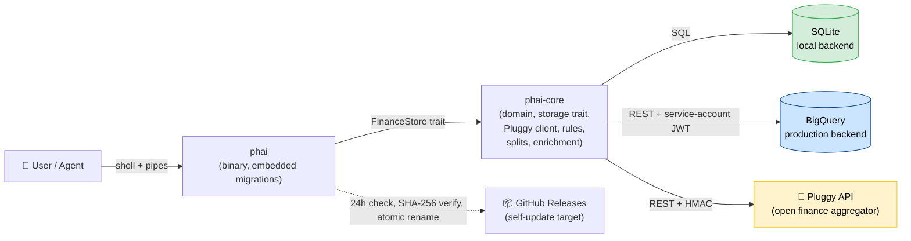
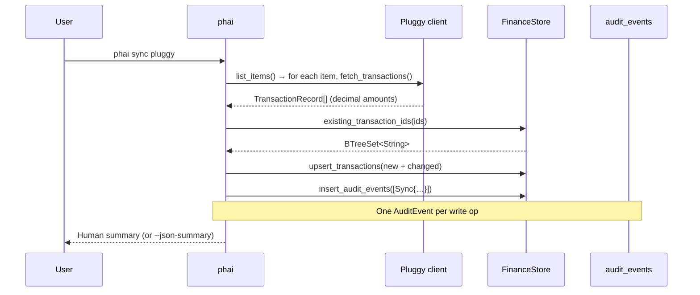
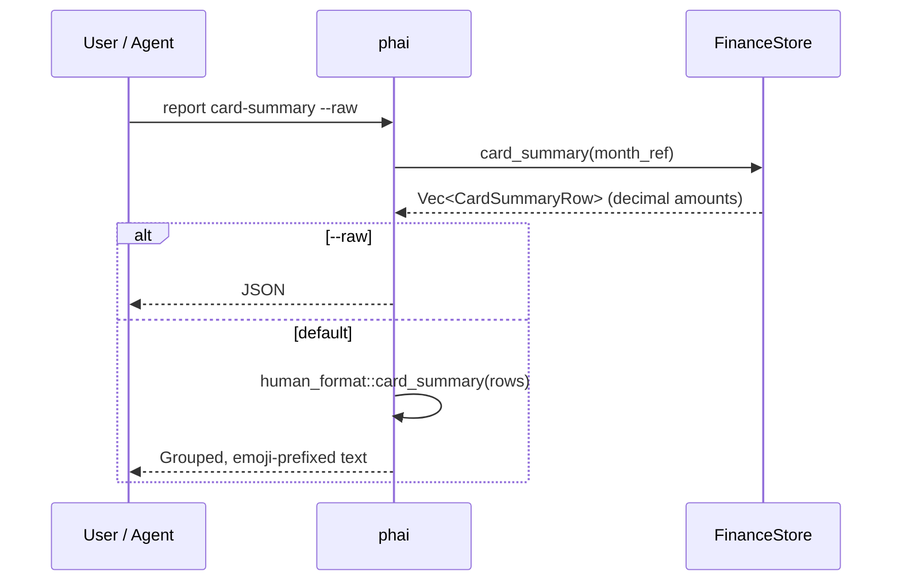

# Architecture

phai is a single-binary Rust CLI that turns a bank feed into a queryable, scriptable, reportable finance database. It connects to [Pluggy](https://pluggy.ai), normalizes everything into a relational store (SQLite local or BigQuery production), and produces human-friendly reports (default) or structured JSON (`--raw`, consumed by AI agents and dashboards).

> See also: [ABSTRACTIONS.md](ABSTRACTIONS.md) for domain models · [VISION.md](VISION.md) for product direction · [adr/](adr/README.md) for individual decisions.

## Design Principles

### 1. The database is the source of truth

Every report, every agent answer, every UI surface derives from the storage layer. There is no parallel cache, no in-memory normalization layer, no derived state that can diverge. If a report disagrees with the database, the database wins and the report is wrong.

### 2. Single binary, zero ceremony

The CLI is one statically-linked binary distributed via `install.sh` and `cargo install`. Migrations are embedded at compile time. The binary self-updates atomically. There is no external runtime — no Postgres, no Redis, no dashboard server. SQLite ships in the binary; BigQuery is reached over HTTPS.

This shapes everything else. New features that would require a long-running process, a sidecar, or a build step on the user's machine are rejected by default.

The exception is the installed `phai serve` production daemon: one official process per machine runs on port 80 and serves both the desktop shell on localhost and other devices on the LAN. High ports are reserved for development, preview and tests, and release builds use a `serve-80.lock` file in the configured data directory to hand over port-80 ownership before binding.

### 3. Decimal precision, always

All monetary amounts use `rust_decimal::Decimal` end-to-end: parsing, arithmetic, storage, serialization. No `f64`. No `f32`. No floating-point lies on amounts. SQLite stores decimals as strings; BigQuery uses `NUMERIC`.

### 4. Every write is an event

Every mutation emits an `AuditEvent` into an append-only table. The dataset is a replayable log: you can rebuild derived state from raw events. This is what makes corrections safe — you don't lose the previous answer, you record a new one.

### 5. Dual backend behind one trait

`FinanceStore` (in `crates/phai-core/src/storage/mod.rs`) abstracts both backends. The CLI never branches on backend type. Migrations exist in parallel in `schema/sqlite/` and `schema/bigquery/`, sharing numeric prefixes and semantics. When the semantics can't match, the feature doesn't ship.

### 6. Privacy is a code rule, not a code review check

No personal counterparty names, account labels, or institution-specific statement fingerprints in shared source. Classification logic lives in the runtime `rules` table or in private configuration. Shared migrations create generic infrastructure only. Shared fixtures use synthetic data.

This is enforced by review and reinforced in [AGENTS.md §1](../AGENTS.md#1-privacy--data-hygiene-hard-rules). It exists because phai is open source, the author runs it on real money, and a leak through a "harmless" hardcoded heuristic is irrecoverable.

### 7. Human-friendly by default, agent-friendly on demand

Every report has a human format (grouped, emoji-prefixed, phone-readable) and a `--raw` JSON format for agents. The human format is the default because the CLI is built for the author's daily WhatsApp pipeline; the JSON format is a peer, not an afterthought.

### 8. Conventional Commits + Release Please = no release ceremony

`feat:` / `fix:` / `BREAKING CHANGE:` on `main` drive automated versioning and changelog. Release Please opens a release PR; merging it cuts a GitHub Release; CI publishes binaries; the installed CLI auto-updates. There is no manual version bump, no manual changelog, no manual artifact upload.

## System Map



## Tech Stack

| Layer | Technology | Notes |
|-------|-----------|-------|
| Language | Rust (edition 2021, MSRV 1.90) | Workspace with two crates |
| CLI framework | `clap` 4.5 (derive) | Subcommand tree generated from structs |
| Local storage | `rusqlite` 0.33 (bundled) | SQLite ships statically in the binary |
| Cloud storage | BigQuery via REST + `yup-oauth2` service-account JWT | No SDK; manual REST keeps the dep graph thin |
| Money | `rust_decimal` 1.36 with `serde` | End-to-end; never `f64` |
| HTTP | `reqwest` (rustls) | Used by Pluggy client and BigQuery |
| Async | `tokio` (rt-multi-thread) | Storage trait is `async fn` |
| Errors | `anyhow` with `.context()` | `thiserror` only at domain boundaries if needed |
| Time | `chrono` (with `serde`) | UTC inside, local format at the edge |
| Migrations | `include_str!` SQL files | Registered in `phai-core::migrations` |
| AI enrichment | `rig-core` | LLM-assisted classification suggestions |
| Search / dedupe | `nucleo` (fuzzy), `deunicode` | Description matching |
| CLI tests | `assert_cmd`, `predicates`, `tempfile`, `serial_test` | E2E run against a real SQLite DB in a tempdir |
| Release | `release-please` + GitHub Actions | Conventional Commits drive versions and CHANGELOG |

## Workspace Layout

```
phai/
├── crates/
│   ├── phai-core/                # Domain + storage trait (no CLI deps)
│   │   └── src/
│   │       ├── lib.rs            # Public re-exports
│   │       ├── models.rs         # AuditEvent, TransactionRecord, …
│   │       ├── config.rs         # AppConfig + ConfigPaths
│   │       ├── storage/
│   │       │   ├── mod.rs        # FinanceStore trait + open_store()
│   │       │   ├── local.rs      # SQLite impl
│   │       │   └── bigquery.rs   # BigQuery impl
│   │       ├── migrations.rs     # Embedded migration registry
│   │       ├── pluggy.rs         # Pluggy REST client
│   │       ├── rules.rs          # Classification rule engine
│   │       ├── splits.rs         # Transaction split logic
│   │       ├── installments.rs   # Parcela chain detection
│   │       ├── idempotency.rs    # Idempotency key derivation
│   │       ├── legacy.rs         # CSV importer
│   │       └── enrichment/       # LLM + heuristics + CNPJ + fuzzy
│   └── phai-cli/                 # Binary
│       └── src/
│           ├── main.rs           # Clap subcommands + dispatch
│           ├── human_format.rs   # WhatsApp-friendly formatters
│           ├── enrich.rs         # `enrich` subcommand
│           ├── update.rs         # Self-update implementation
│           ├── update_state.rs   # 24h throttle state
│           ├── self_cmd.rs       # `self check` / `self update`
│           └── review.rs         # `review` HTML report
├── schema/
│   ├── sqlite/                   # Migrations (NNN_name.sql)
│   └── bigquery/                 # Migrations (NNN_name.sql) — mirror of sqlite/
├── integrations/
│   └── openclaw/                 # AI assistant skill + wrapper
├── docs/
│   ├── ARCHITECTURE.md           # This file
│   ├── ABSTRACTIONS.md           # Domain model details
│   ├── VISION.md                 # Product direction
│   ├── GETTING-STARTED.md        # Onboarding
│   └── adr/                      # Architecture Decision Records
├── .github/workflows/            # CI + Release Please
├── AGENTS.md                     # Agent guardrails
├── REPORTING_UX.md               # Reporting voice & disambiguation rules
└── install.sh                    # Single-binary installer
```

## Data Flow

### Sync (Pluggy → store)



Idempotency keys are derived from the Pluggy payload in `idempotency.rs`. Re-running `sync` is safe — `upsert_transactions` does not duplicate.

### Report



Reports read from views, not raw tables. Views encode the business logic (sign normalization for credit-card transactions, internal-transfer exclusion, effective categorization with overrides, and display labels that fall back from `description` to `merchant_name` to `raw_description`). See `schema/sqlite/033_transaction_anatomy.sql`.

Recurring human-reviewed transactions can inherit `description`, `purpose`, and trusted human category from prior same-merchant or same-raw-description history. This is direct replication with amount-tolerant donor scoring, not automatic rule creation; see [ADR-0033](adr/0033-recurring-human-review-replication.md).

#### Canonical reporting view chain (single source of truth)

All cash-flow/spend reporting — the CLI, the cashflow chart, and the web UI — reads **one** view chain. Dedup and classification live *inside* it; no report or query method re-derives them. This is the rule that stops the cash-flow numbers from regressing (see [ADR-0026](adr/0026-single-view-chain-canonical-source.md) and [ADR-0025](adr/0025-cashflow-basis-bill-explosion.md)):

```
transactions                       raw rows (Pluggy / OFX / legacy / manual)
  └─ v_transactions_effective      splits expansion + display labels
       └─ v_transactions_reportable  dedup: drops legacy-manual + ofx rows
            │                          shadowed by a Pluggy row (anti-joins)
            └─ v_transactions_cashbasis  + canonical cash_month: a card purchase
                 │                         falls in the month its bill is PAID,
                 │                         from billing_closing_day/billing_due_day
                 ├─ v_cashflow            monthly income/expenses/net (cash basis)
                 └─ v_monthly_spend       per-category monthly spend
```

- **Cash basis, not accrual.** A family sees the month its money actually moves: a credit-card bill paid in May explodes into its individual purchases under May (not a lump payment, not on the original purchase dates). Requires `billing_closing_day`/`billing_due_day` on each card (`phai account set-billing-cycle`); without them a card falls back to the calendar posting month.
- **Internal categories** (`credit-card-payment`, `transfer-internal`, `same-person-transfer`) are the single exclusion list, applied in the views — so paying a card bill, or moving money between two *tracked* own accounts, never double-counts. Money arriving from an *untracked* account (e.g. a salary relay) is real income and is **not** excluded.
- `FinanceStore::cashflow_reportable` is a thin `SELECT … FROM v_cashflow`. New reporting reads the chain; new rules go into `v_transactions_reportable` or the exclusion list — never into a Rust query or the web layer.

To validate the chain against the bank, see the [data-consistency runbook](runbook-data-consistency.md).

### Self-update (atomic, SHA-256-verified)

See [ADR-0007](adr/0007-atomic-self-update.md). On macOS, the running binary atomically renames the new binary over its own path, then `execv`s with a `FINANCE_OS_UPDATED=<version>` sentinel to prevent loops. The sentinel disables the auto-check in the child process.

## Storage Boundary

The `FinanceStore` trait is the seam between domain code and persistence. It is intentionally wide (~50 methods) because:

1. The domain is finite. phai is not a generic ORM — every method maps to a well-known query.
2. Pushing logic into the trait keeps each backend's implementation flat and auditable. The same SQL idea lives in two files, side by side; that makes review for parity easy.
3. Reports are first-class methods (`daily_pulse`, `card_summary`, `cashflow`, …) because they bundle the business logic that distinguishes "raw amounts" from "what you should see."

When adding a new method:

- Add it to the trait in `storage/mod.rs`.
- Implement it in `storage/local.rs` and `storage/bigquery.rs` in the same PR.
- If the implementation needs a new view, add a migration to both `schema/sqlite/` and `schema/bigquery/`.
- E2E test against SQLite (`tempfile` + `serial_test`); the BigQuery path is exercised by parity review and by smoke tests in the author's environment.

### Known backend-divergence

The dual-backend principle is a promise, not an invariant — there is one place where it is currently broken:

- **Splits and receipt-item analytics are BigQuery-only.** The schema (`schema/bigquery/014_transaction_splits.sql`) and the implementation in `storage/bigquery.rs` cover `tx split preview/apply/show/clear`, `report split-candidates`, and `report item-prices`. The SQLite impl returns `split_bigquery_only_error()` on each. The CLI surfaces this clearly. Tracked as parity debt — see [docs/ABSTRACTIONS.md §Splits](ABSTRACTIONS.md#splits) and [docs/tx-splits-cli-test-plan.md](tx-splits-cli-test-plan.md).

New backend-divergence should be a deliberate choice with a documented reason in the migration file header and a tracking note here, not a silent drift.

## CI & Release

`.github/workflows/ci.yml`:

- `cargo fmt --check`, `cargo clippy -D warnings`, `cargo test --workspace`
- `cargo audit` via `rustsec/audit-check@v2`
- `cargo deny check licenses`

Release Please runs on `main`, parses Conventional Commits, and maintains an open release PR with the next version and CHANGELOG. The whole workspace ships as a single version (sourced from `workspace.package.version`, one root release-please package, one `vX.Y.Z` tag) — see [ADR-0020](adr/0020-single-workspace-version.md). Merging that PR triggers the release workflow which builds, uploads, and signs platform tarballs. The CLI's self-updater consumes those releases.

## Where to make changes

| Want to… | Edit |
|---|---|
| Add a CLI subcommand | `crates/phai-cli/src/main.rs` (clap derive) |
| Add a report | New `FinanceStore` method + `human_format.rs` formatter + view migration |
| Add a domain model | `crates/phai-core/src/models.rs` |
| Change a storage shape | New migration in both `schema/sqlite/` and `schema/bigquery/`; update `migrations.rs` |
| Add a bank aggregator | New module beside `pluggy.rs`; do **not** generalize prematurely |
| Tune classification | `rules` table (runtime) or `enrichment/` (heuristics + LLM glue) |
| Change reporting voice | `human_format.rs` + update [REPORTING_UX.md](../REPORTING_UX.md) |
| Document a decision | New ADR in `docs/adr/` |
